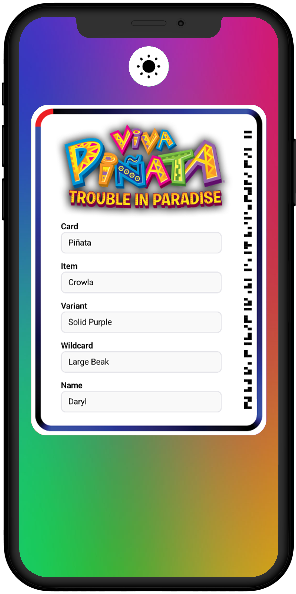
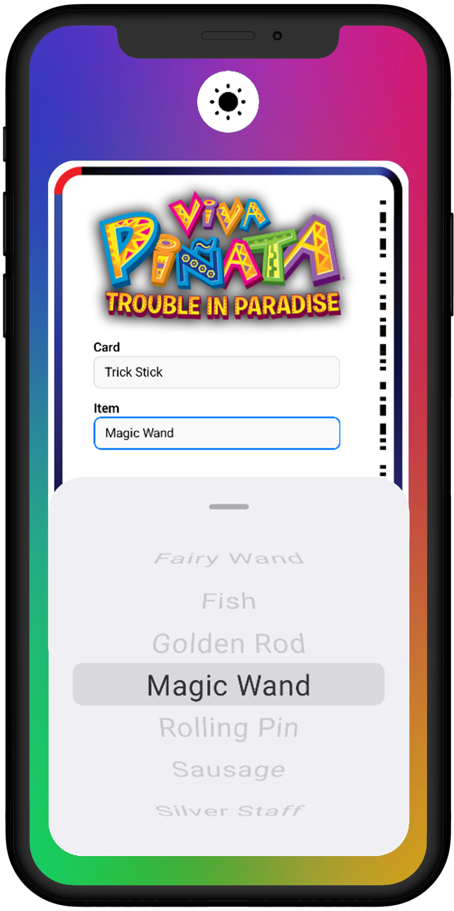
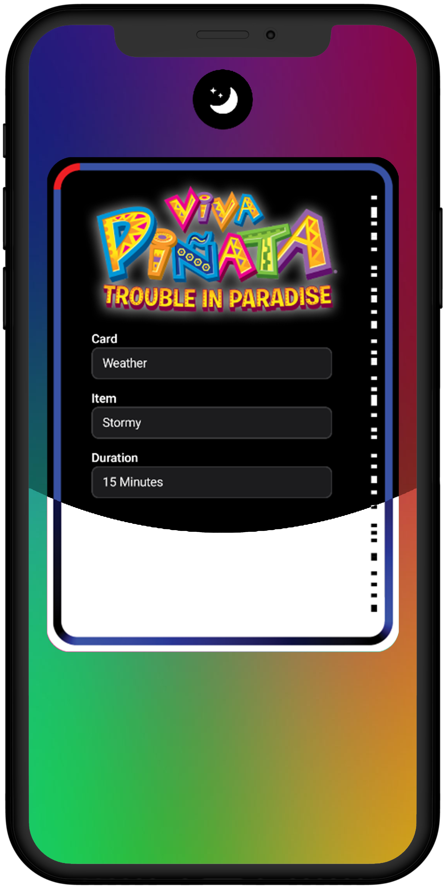
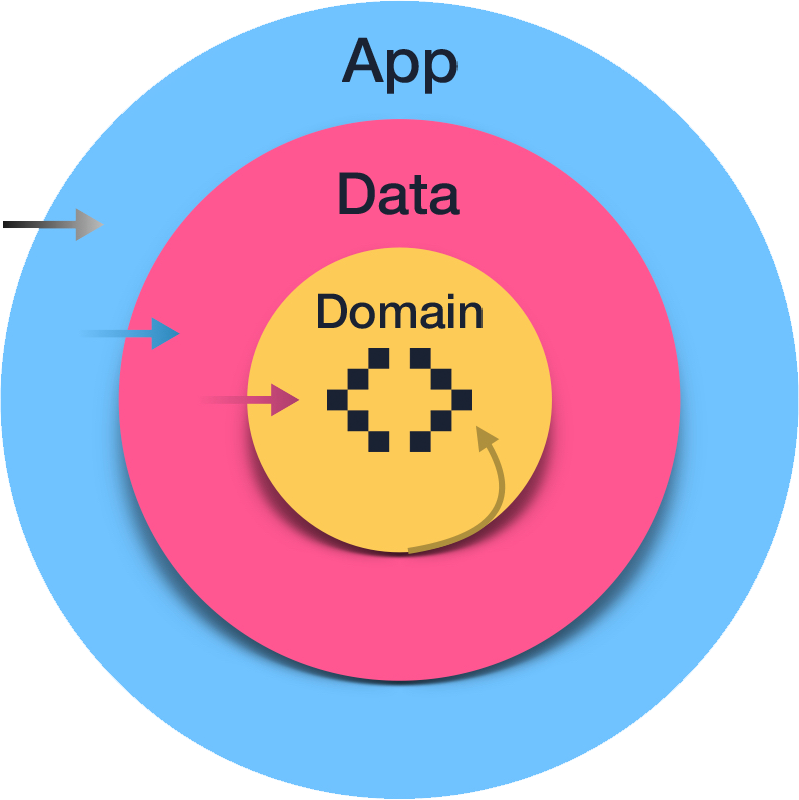

<h1 align="center">
  <🍬> PV Creator
</h1>

  Mobile app to design custom Piñata Vision cards for <em>Viva Piñata: Trouble in Paradise</em>.
   
  Spice up the game your way — on <a href="https://play.google.com/store/apps/details?id=com.raks.pvcreator">Google Play</a> 📲

## 🎨 UI Design

|                                                                                 Main Screen                                                                                  |                                                                                   Picker Screen                                                                                    |                                                                                   Switch Screen                                                                                    |
| :--------------------------------------------------------------------------------------------------------------------------------------------------------------------------: | :--------------------------------------------------------------------------------------------------------------------------------------------------------------------------------: | :--------------------------------------------------------------------------------------------------------------------------------------------------------------------------------: |
| <picture><source media="(prefers-color-scheme: dark)" srcset="docs/imgs/dark/en/screen-main.png"></picture> | <picture><source media="(prefers-color-scheme: dark)" srcset="docs/imgs/dark/en/screen-picker.png"></picture> | <picture><source media="(prefers-color-scheme: dark)" srcset="docs/imgs/dark/en/screen-switch.png"></picture> |

## 🛠 Built With

- [Kotlin](https://kotlinlang.org) - First class and official programming language for Android development.
- [Coroutines](https://kotlinlang.org/docs/reference/coroutines-overview.html) - For asynchronous and more...
- [Android Architecture Components](https://developer.android.com/topic/architecture?hl=en) - Collection of libraries that help you design robust, testable, and maintainable apps.
  - [Stateflow](https://developer.android.com/kotlin/flow/stateflow-and-sharedflow?hl=en) - StateFlow is a state-holder observable flow that emits the current and new state updates to its collectors.
  - [Flow](https://kotlinlang.org/docs/reference/coroutines/flow.html) - A flow is an asynchronous version of a Sequence, a type of collection whose values are lazily produced.
  - [ViewModel](https://developer.android.com/topic/libraries/architecture/viewmodel?hl=en) - Stores UI-related data that isn't destroyed on UI changes.
  - [Room](https://developer.android.com/training/data-storage/room?hl=en) - SQLite object mapping library.
  - [DataStore](https://developer.android.com/topic/libraries/architecture/datastore?hl=en) - Jetpack DataStore is a data storage solution that allows you to store key-value pairs or typed objects with protocol buffers. DataStore uses Kotlin coroutines and Flow to store data asynchronously, consistently, and transactionally.
- [Hilt](https://developer.android.com/training/dependency-injection/hilt-android?hl=en) - For dependency injection.
- [BuildSrc](https://docs.gradle.org/current/userguide/organizing_gradle_projects.html#sec:build_sources) - Utilized Gradle's buildSrc to enhance project organization and simplify dependency management.
- [Material Components for Android](https://github.com/material-components/material-components-android) - Modular and customizable Material Design UI components for Android.

## 🏗️ Architecture Design

- **This app follows the [_MVVM (Model View ViewModel)_](https://developer.android.com/topic/architecture?hl=en#recommended-app-arch) architecture.**
- **Additionally, I've implemented _Hexagonal_ architecture to enhance flexibility and adaptability.**
  - `domain` can only import files from the same folder
  - `data` can only import from `data` and `domain`
  - `app` can import from `app`, `data` and `domain`

    

