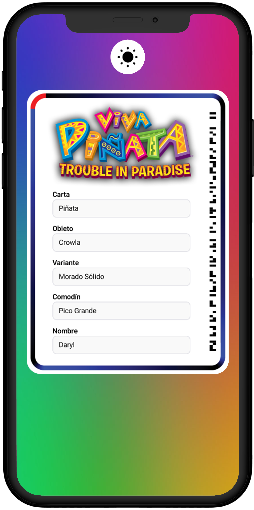
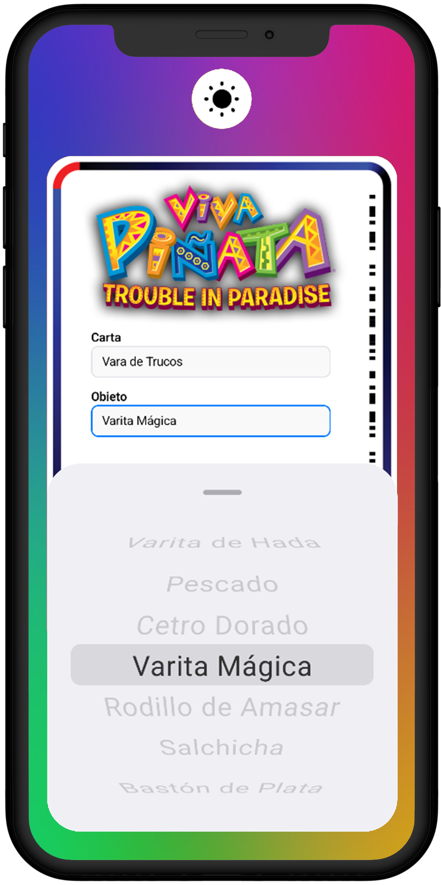
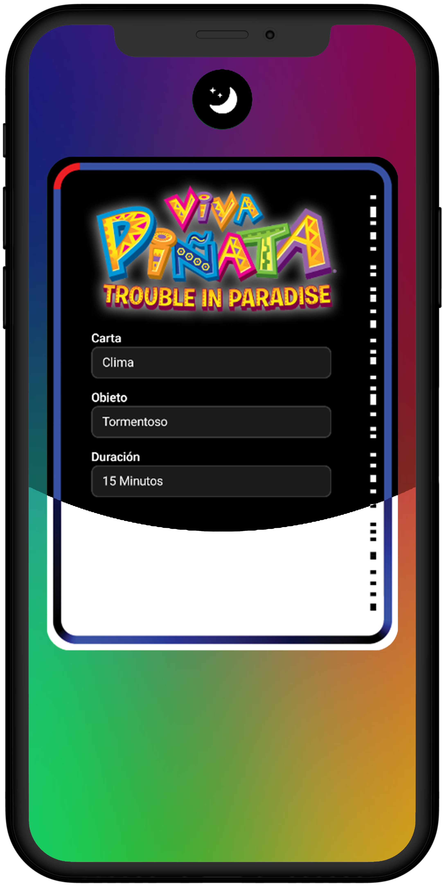

<h1 align="center">
  <🍬> PV Creator
</h1>

<picture>
  <source media="(prefers-color-scheme: dark)" srcset="docs/imgs/dark/logo-pvcreator.png">
  
</picture>

## Resumen Proyecto

[PV Creator](https://play.google.com/store/apps/details?id=com.raks.pvcreator&hl=es) es una aplicación móvil que permite a los usuarios diseñar cartas personalizadas Piñata Vision para **Viva Piñata: Trouble in Paradise**.

Mejorando su experiencia en el juego a través de creaciones personalizadas.

Agradecimiento especial a Peter Jensen por crear el PV Creator original para iOS.

 

## 🎨 Diseño de UI

|                                                                                 Pantalla Principal                                                                                  |                                                                                   Pantalla Selección                                                                                    |                                                                                   Pantalla Cambio                                                                                    |
| :---------------------------------------------------------------------------------------------------------------------------------------------------------------------------------: | :-------------------------------------------------------------------------------------------------------------------------------------------------------------------------------------: | :----------------------------------------------------------------------------------------------------------------------------------------------------------------------------------: |
| <picture><source media="(prefers-color-scheme: dark)" srcset="docs/imgs/dark/es/screen-main.png"></picture> | <picture><source media="(prefers-color-scheme: dark)" srcset="docs/imgs/dark/es/screen-picker.png"></picture> | <picture><source media="(prefers-color-scheme: dark)" srcset="docs/imgs/dark/es/screen-switch.png"></picture> |

## 🛠 Características

- [Kotlin](https://kotlinlang.org) - Lenguaje de programación de primera clase y oficial para el desarrollo en Android.
- [Coroutines](https://kotlinlang.org/docs/reference/coroutines-overview.html) - Para procesos asíncronos y más...
- [Android Architecture Components](https://developer.android.com/topic/architecture?hl=es) - Colección de librerías que te ayudan a diseñar aplicaciones robustas, comprobables y mantenibles.
  - [Stateflow](https://developer.android.com/kotlin/flow/stateflow-and-sharedflow?hl=es) - StateFlow es un flujo observable que emite las actualizaciones de estado actual y nuevo a sus colectores.
  - [Flow](https://kotlinlang.org/docs/reference/coroutines/flow.html) - Un flujo es una versión asíncrona de una secuencia, un tipo de colección cuyos valores se obtienen perezosamente.
  - [ViewModel](https://developer.android.com/topic/libraries/architecture/viewmodel?hl=es) - Almacena datos relacionados con la interfaz de usuario que no se destruyen con los cambios de la interfaz.
  - [Room](https://developer.android.com/training/data-storage/room?hl=es) - Biblioteca de mapeo de objetos SQLite.
  - [DataStore](https://developer.android.com/topic/libraries/architecture/datastore?hl=es) - Jetpack DataStore es una solución de almacenamiento de datos que permite almacenar pares clave-valor u objetos tipados con buffers de protocolo. DataStore utiliza Coroutines y Flow para almacenar datos de forma asíncrona, consistente y transaccional.
- [Hilt](https://developer.android.com/training/dependency-injection/hilt-android?hl=es) - Para inyección de dependencias.
- [BuildSrc](https://docs.gradle.org/current/userguide/organizing_gradle_projects.html#sec:build_sources) - Utiliza buildSrc de Gradle para mejorar la organización del proyecto y simplificar la gestión de dependencias.
- [Material Components para Android](https://github.com/material-components/material-components-android) - Componentes de interfaz de usuario Material Design modulares y personalizables para Android.

## 🏗️ Diseño de Arquitectura

- **Esta aplicación sigue la arquitectura [_MVVM (Modelo Vista Modelo de Vista)_](https://developer.android.com/topic/architecture?hl=es#recommended-app-arch).**
- **Además, he implementado la arquitectura _Hexagonal_ para mejorar la flexibilidad y adaptabilidad.**
  - `domain` sólo puede importar archivos de su mismo módulo
  - `data` sólo puede importar de `data` and `domain`
  - `app` puede importar de `app`, `data` and `domain`

    

